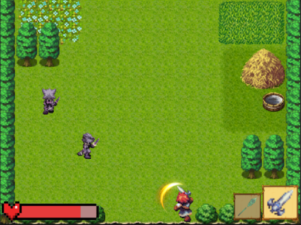

<h1 align="center"> 🎮 Hero Adventure 🎮</h1>

<p align="center">
 <a></a>
  <br>
</p>


<p align="center">
  <a href="https://unity.com/"></a>
  <a href="./LICENSE"></a>
</p>

# Game Trailer
- Links: [Youtube](https://www.youtube.com/watch?v=HOuMJov_7kc) (Unlisted mode)

# Intro
- Inspired by ```hack 'n slash``` game series, typically the famous Hades game, the team decided to build a 2D dungeon-passing game through fighting monsters, upgrading weapons, skills... The game is named is Hero Adventure, describing the process of defeating the character's final boss.

- The game currently has a total of 10 stages, in order to pass a level, the player must defeat all the monsters in that level. Players can choose between melee or ranged to play. After defeating the monsters, the player can choose one of two skills at random to carry with them throughout the following levels. When the player loses all health, the player will be resurrected to the starting place and lose all skills received. Here players can use the gold earned through the game screen to upgrade weapons, unlock more skills of weapons. The ultimate goal is to fully prepare everything to be able to pass all 10 levels in one turn and win the game.

# How to play
- Players will use the keyboard to interact with the game. Use arrow keys to move; the ZXC and Shift keys to perform actions and the Space key to interact. You can also press Esc to pause the game.

# Summary
- The game was able to release the first demo, although there are still many bugs and undeveloped features. The content of the game is still lacking due to the lack of familiarity with Unity for the first time, so it has not allocated time and appropriate work. However, the game can still have the nature of a ```hack 'n slash```, ```RPG``` game and still install important features.

# References:
- Free assets from https://assetstore.unity.com/
```
https://assetstore.unity.com/packages/audio/music/free-music-and-sfx-collection-4369
https://assetstore.unity.com/packages/audio/music/orchestral/rpg-orchestral-essentials-legacy-free-sample-pack-148199
https://assetstore.unity.com/packages/audio/sound-fx/weapons/weapon-soldier-sounds-pack-29662
https://assetstore.unity.com/packages/audio/sound-fx/free-casual-island-game-sounds-166441
https://assetstore.unity.com/packages/audio/sound-fx/weapons/ultra-sci-fi-game-audio-weapons-pack-vol-1-113047
https://assetstore.unity.com/packages/audio/sound-fx/weapons/bow-and-hammer-sound-effects-163948
https://assetstore.unity.com/packages/2d/gui/2d-ui-buttons-free-package-for-unity-developer-by-javedkhanme-198453 
```

- Sprite Resources: From the Abyss
- RPG Maker VX
